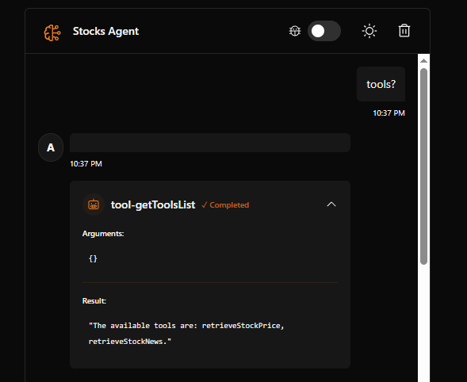
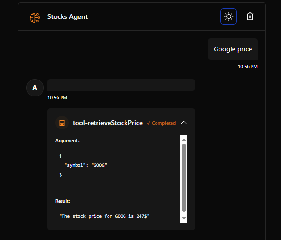
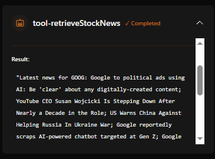

# AI Project

This project leverages Cloudflare AI technology to build intelligent agents that empower users with real-time stock price insights and the latest financial news. By integrating advanced AI tools, the agents deliver accurate market data and curated news, helping users make informed investment decisions with ease and confidence.

## Features

- 💬 Interactive chat interface with AI
- 🛠️ Built-in tool system
- 🌓 Dark/Light theme support
- ⚡️ Real-time streaming responses
- 🔄 State management and chat history
- 🎨 Modern, responsive UI

## Prerequisites

- Alpha Vantage API key

## Quick Start

1. Clone repository

2. Install dependencies:

```bash
npm install
```

3. Run locally:

```bash
npm start
```





